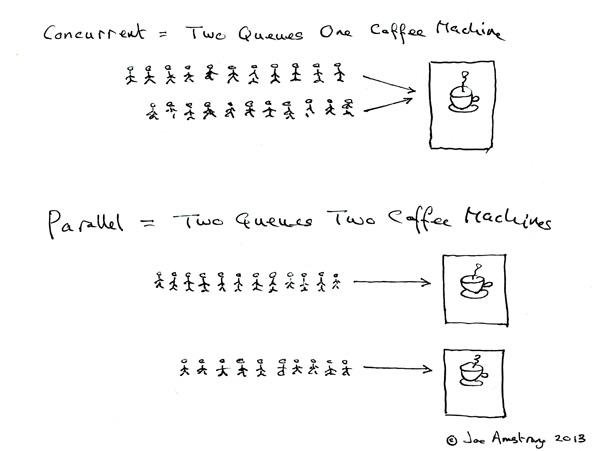

# 并发和并行

- 并发，指的是多个任务**同时存在**。 
- 并行，指的是多个任务**同时执行**。 
- 只有在多`CPU`的情况中，才会发生并行。 
- 否则，看似同时发生的事情，其实都是并发执行的。
- **“并行”概念是“并发”概念的一个子集。**
- 并行一定是并发，反之并发只有在多核时才可能并行。
---

用咖啡机的场景来解释 并行 和 并发 的区别：

---

### 1. 并行
**[场景]**  
一个咖啡店有 **2台咖啡机**，两台咖啡机同时工作，分别制作不同的咖啡。例如：
- 咖啡机A制作美式
- 咖啡机B制作拿铁

**[关键点]**  
- **同时执行**：两台机器物理上同时工作。
- **依赖硬件支持**：需要多台咖啡机（类比计算机多核CPU）。
- **效率提升**：总制作时间缩短为单台机器的一半。

---

### 2. 并发
**[场景]**  
**只有1台咖啡机**，但咖啡师通过“快速切换任务”处理多个订单。例如：
1. 咖啡师启动咖啡机做美式 → 等待加热时，去准备拿铁的牛奶。
2. 美式完成后，切换制作拿铁 → 等待浓缩咖啡时，清理台面。
3. 拿铁完成后，继续制作卡布奇诺。

**[关键点]**  
- **交替执行**：单台机器通过任务切换处理多个订单。
- **逻辑上的“同时”**：用户感觉咖啡在“同时制作”（实际是快速轮转）。
- **资源利用率高**：避免机器空闲（如加热时做其他事）。

---

### 对比总结
|                | 并行       | 并发       |
|----------------|--------------------------|--------------------------|
| **核心区别**   | 同时执行任务             | 交替执行任务             |
| **硬件要求**   | 多核/多处理器（多咖啡机）| 单核即可（单咖啡机）     |
| **典型场景**   | 视频渲染、科学计算       | 网页服务器、操作系统     |
| **效率来源**   | 物理并行加速             | 减少空闲等待时间         |

---

### **计算机中的类比**
- **并行**：多核CPU同时运行多个线程（如同时下载文件+播放音乐）。
- **并发**：单核CPU通过时间片轮转，让多个线程“看似同时运行”（如边打字边自动保存文档）。