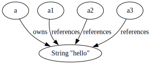
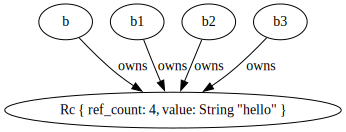

# Rc和Arc

- 用于共享所有权。
- 允许多个所有者，数据在最后一个 Rc 销毁时释放。
- 适合跨作用域或复杂数据结构共享数据。

## `Rc<T>`
```rust
use std::rc::Rc;

fn main() {
  let a = String::from("hello");
  let b = a;
  // let c = a;
  //         ^ 这里将报错，因为a的所有权被移交给了b

  println!("{}", b);


  let d = Rc::new(b);
  // 使用 Rc::strong_count 可以获取Rc类型的引用次数
  let f = Rc::strong_count(&d);
  println!("d的引用次数 {f}");

  // 使用Rc::clone可以克隆一份智能指针，使得对应的Rc引用次数+1
  // 也可以使用 .clone() 方法。但是为了可读性（避免被认为是Copy trait的方法）更推荐使用Rc::clone
  // Rc::clone 仅仅复制了智能指针，并增加引用计数，这与Copy trait的clone(克隆底层数据)有着本质区别。
  let e = Rc::clone(&d); // 引用次数+1
  let f = Rc::strong_count(&d);
  println!("d的引用次数 {f}");

  assert_eq!(Rc::strong_count(&d), Rc::strong_count(&e));

  {
    let g = d.clone(); // 这里发生 +1
    let f = Rc::strong_count(&d);
    println!("d的引用次数 {f}");
  } // g离开作用域 g被drop, Rc引用 -1

  let f = Rc::strong_count(&d);
  println!("d的引用次数 {f}");
}

```

## 与`&T`的区别

```rust
use std::rc::Rc;

#[allow(unused)]
fn main() {
  let a = String::from("hello");
  let a1 = &a;
  let a2 = &a;
  let a3 = &a;
  
  let b = Rc::new(String::from("hello"));
  let b1 = Rc::clone(&b);
  let b2 = Rc::clone(&b);
  let b3 = Rc::clone(&b);
}
```
`&a`不也可以实现多次引用吗，为什么还需要`Rc`？

<div style="text-align: center">
    <div style="border: 1px solid #ccc;width:100%;">
         
        <label>引用</label>
    </div>
    <div style="border: 1px solid #ccc;width:100%;">
         
        <label>Rc</label>
    </div>
</div>

举两个简单的例子
### 函数返回引用/Rc
```rust
use std::rc::Rc;

#[allow(unused)]
fn mian() {
  fn return_borrow() {
    let s = String::from("hello");
    // &s
    // ^ 这里如果返回 &s 将造成悬垂引用。代码报错
  }

  fn return_rc() -> Rc<String> {
    let s = Rc::new(String::from("hello"));
    s
    // 可以返回，交给Rc 管理生命周期
  }


  return_borrow(); // 如果非要函数体内部的数据，智能返回一个数据本体（非引用）
  let s = return_rc();
  println!("{}", s); // 无惧声明周期 继续访问

}
```
### 提前drop
```rust
use std::rc::Rc;

#[allow(unused)]
fn mian() {
  fn drop_borrow() {
    struct Wrapper<'a>(&'a String);

    let s = String::from("hello");
    let w = Wrapper(&s);
    std::mem::drop(s);
    // println!("{}", w.0);
    //                ^^^ 再访问w将发生报错 因为s被drop 发生悬垂引用
  }

  fn drop_rc() {
    struct  Wrapper(Rc<String>);
    let s = Rc::new(String::from("hello"));

    let w = Wrapper(Rc::clone(&s));

    std::mem::drop(s);
    println!("{}", w.0);
    // 虽然s被drop 但w不受影响😎
  }

  drop_borrow();
  drop_rc();
}
```

## `Arc<T>`
Rc只能在单线程中共享数据。\
Arc可以在多线程中共享数据。
```rust
fn main() {
  // let s = Rc::new(String::from("hello"));
  //         ^^^^^ 没有实现Send trait
  let s = std::sync::Arc::new(String::from("hello"));
  for index in 0..10 {
    let s_ = s.clone();
    let handle = std::thread::spawn(move || {
      println!("in {}, {}", index, s_)
    });
  }
  println!("world")
}
```