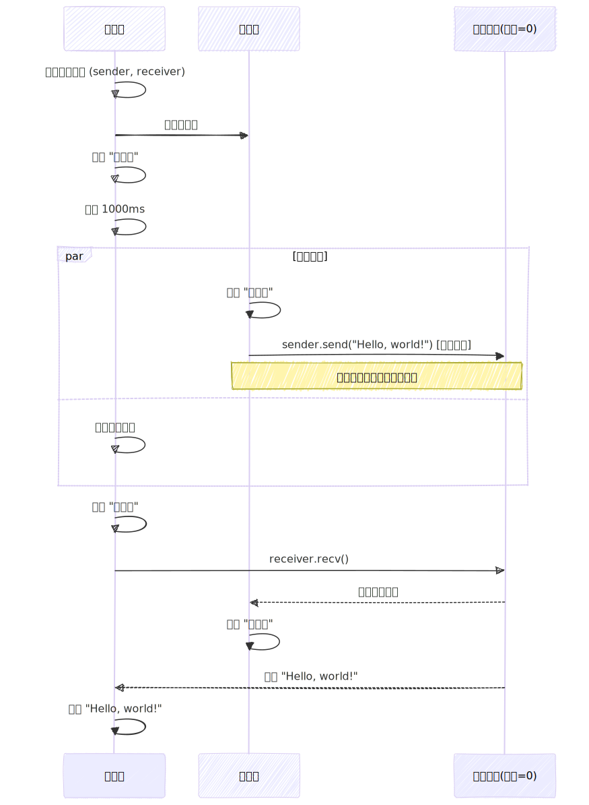

# 线程通信


## `mpsc::channel`

```rust
use std::sync::mpsc;
use std::thread;

fn main() {
  // 创建消息通道
  let (sender, receiver) = mpsc::channel();

  thread::spawn(move || {
    sender.send("Hello").unwrap(); // 发送消息
  });

  // 接收消息
  let message = receiver.recv().unwrap();
  // receiver.recv 会阻塞线程，直至接收到消息或者通道关闭

  println!("{}", message);
}
```

## 非阻塞的接收
```rust
use std::sync::mpsc;
use std::thread;

fn main() {
  let (sender, receiver) = mpsc::channel();

  let handle = thread::spawn(move || {
    sender.send("Hello").unwrap();
  });

  // try_recv 不会阻塞线程，不会等待消息
  match receiver.try_recv() {
    Ok(message) => println!("收到了消息：{}", message),
    Err(e) => println!("我要退出了，但是还没收到消息，不等了: {e}"),
  }
}
```

## 多次发送消息
```rust
use std::sync::mpsc;
use std::thread;
use std::time::Duration;

fn main() {
  let (sender, receiver) = mpsc::channel();

  thread::spawn(move || {
    for i in 1..10 {
      sender.send(i).unwrap();
      thread::sleep(Duration::from_millis(1000));
    }
  });

  for result in receiver {
    println!("{}", result);
  }
  println!("收到了所有消息");
}
```

## 多个发送者 单个接收者
```rust
use std::sync::mpsc;
use std::thread;

fn main() {
  let (sender, receiver) = mpsc::channel();

  for i in 0..5 {
    let sender_clone = sender.clone();
    thread::spawn(move || {
      sender_clone.send(
        format!("来自{i}, id: {:?}", thread::current().id())
      ).unwrap();
    });
  }

  // 释放原始发送端 否则函数无法退出
  drop(sender);

  for result in receiver {
    println!("{}", result);
  }
}
```

## 异步通道与同步通道

1. 异步通道：
  - 发送操作是异步的，子线程不会阻塞
  - 主线程休眠时，子线程可以完成发送操作
  - 输出顺序体现线程并行性
2. 同步通道：
  - 发送操作会阻塞（因缓冲大小为0）
  - 子线程发送时需等待主线程结束休眠并调用recv()
  - 输出顺序体现线程同步性


### 异步通道
```rust
use std::sync::mpsc;
use std::thread;
use std::time::Duration;

fn main() {
  let (sender, receiver) = mpsc::channel();

  thread::spawn(move || {
    println!("发送前");
    sender.send("Hello, world!").unwrap();
    println!("发送后");
  });

  println!("睡眠前");
  thread::sleep(Duration::from_millis(1000));
  println!("睡眠后");

  let message = receiver.recv().unwrap();
  println!("{}", message);
}
```
```text
 睡眠前
 发送前
 发送后
 -- 睡眠1秒 --
 睡眠后
 Hello, world!
```

### 同步通道
```rust
use std::sync::mpsc;
use std::thread;
use std::time::Duration;

fn main() {
  let (sender, receiver) = mpsc::sync_channel(0);

  thread::spawn(move || {
    println!("发送前");
    sender.send("Hello, world!").unwrap();
    println!("发送后");
  });

  println!("睡眠前");
  thread::sleep(Duration::from_millis(1000));
  println!("睡眠后");

  let message = receiver.recv().unwrap();
  println!("{}", message);


}
```
```text
睡眠前
发送前
-- 睡眠1秒 --
睡眠后
Hello, world!
发送后
```

<div style="display:flex; width: 100%;overflow:hidden;text-align:center;">
    <div style="flex: 1;overflow:hidden;border:1px solid #ccc;">
        <label>异步通道</label>
        
    </div> 
    <div style="flex: 1;overflow:hidden;border:1px solid #ccc;">
        <label>同步通道</label>
        
    </div> 
</div> 
