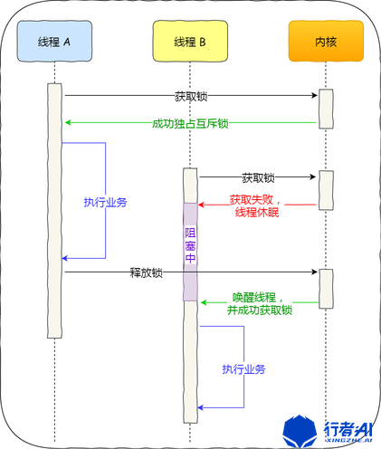

# 线程同步：锁、Condvar 和信号量


## `Mutex` 锁🔒
```rust
use std::sync::{Mutex};

fn main() {
  let m = Mutex::new(0);
  {
    let mut lock = m.lock().unwrap();
    //       |                   ^^^^^^^ 使用lock方法向Mutex申请锁
    //       |                           lock方法调用时会阻塞当前线程，直到获取到锁
    //       ^ 获取到了锁。
    // 因此当多个线程同时访问该数据时，
    // 只有一个线程能获取到锁，其它线程只能阻塞着等待，
    // 直到这个锁被当前线程释放，其他某一线程才可获取到这个锁
    *lock = 1;
    // ^^^^^^ 修改被锁保护的值
  } // ← 当 lock 离开作用域后。lock被自动drop。锁被释放

  println!("{:?}", *m.lock().unwrap());
}
```

## 单线程死锁
```rust
use std::sync::{Mutex};

fn main() {
  let m = Mutex::new(0);
  let mut lock1 = m.lock().unwrap();
  *lock1 = 1;
  // ^^^^ lock1 没有被drop

  // drop(lock1);
  // ^^^^ 除非手动销毁锁

  {
    let mut lock2 = m.lock().unwrap();
    // ^^^^ lock1 没有被drop 就申请第二把锁
    *lock2 = 2;
  }
  println!("{:?}", m);
}
```
**总结： 只有再上把锁被`drop`后才能再次获取锁，否则将造成死锁。**

## 多线程间修改数据（共享所有权）
```rust
use std::sync::{Arc, Mutex};
use std::thread;
use std::thread::sleep;
use std::time::Duration;

fn main() {
  let counter = Arc::new(Mutex::new(0));
  let mut handles = vec![];

  for _ in  0..10 {
    let counter = Arc::clone(&counter);
    let handle = thread::spawn(move || {
      let mut mun = counter.lock().unwrap();

      *mun += 1;
    });

    handles.push(handle);
  }

  for handle in handles {
    handle.join().unwrap();
  }
  println!("{:?}", *counter.lock().unwrap());
}
```

总结：
- `Rc<T>`和`RefCell<T>`用于单线程内部可变性;
- `Arc<T>`和`Mutex<T>`用于多线程间的内部可变性。



## 多线程死锁

```rust
use std::sync::{Arc, Mutex};
use std::thread;
use std::thread::sleep;
use std::time::Duration;

fn main() {
  let mut handles = vec![];
  let counter1 = Arc::new(Mutex::new(0));
  let counter2 = Arc::new(Mutex::new(0));

  let counter1_ = Arc::clone(&counter1);
  let counter2_ = Arc::clone(&counter2);
  handles.push(thread::spawn(move || {
    let a = counter1.lock().unwrap(); // 锁定 counter1
    sleep(Duration::from_millis(100));
    let b = counter2.lock().unwrap(); // 尝试锁定 counter2 但 counter2 已经被锁定
    println!("1");
  }));

  handles.push(thread::spawn(move || {
    let a = counter2_.lock().unwrap(); // 锁定 counter2
    sleep(Duration::from_millis(100));
    let b = counter1_.lock().unwrap(); // 尝试锁定 counter1 但 counter1 已经被锁定
    println!("2");
  }));

  // 两个线程互相等待 形成死锁

  for handle in handles {
    handle.join().unwrap();
  }
  println!("end")
}
```

## `try_lock`
避免多线程死锁。使用`try_lock`代替`lock`。
```rust
use std::sync::{Arc, Mutex};
use std::thread;
use std::thread::sleep;
use std::time::Duration;

fn main() {
  let mut handles = vec![];
  let counter1 = Arc::new(Mutex::new(0));
  let counter2 = Arc::new(Mutex::new(0));

  let counter1_ = Arc::clone(&counter1);
  let counter2_ = Arc::clone(&counter2);
  handles.push(thread::spawn(move || {
    let a = counter1.lock().unwrap(); // 锁定 counter1
    sleep(Duration::from_millis(100));
    // let b = counter2.lock().unwrap();
    if let Ok(b) = counter2.try_lock() {
      //                                    ^^^^^^^^ 使用try_lock替代lock
      println!("handle1 v = {}", b)
    } else {
      println!("handle1 get counter2 error")
    }

    println!("1");
  }));

  handles.push(thread::spawn(move || {
    let a = counter2_.lock().unwrap(); // 锁定 counter2
    sleep(Duration::from_millis(100));
    // let b = counter1_.try_lock();
    let b = match counter1_.try_lock() {
      Err(e) => println!("handle2 get counter1 error {}", e),
      Ok(v) => println!("handle2 v = {}", v)
    };
    println!("2");
  }));

  for handle in handles {
    handle.join().unwrap();
  }
  println!("end")
}
```

## `RwLock`

### 只读
多个只读不会阻塞线程。
```rust
use std::sync::{RwLock};

fn main() {
  let counter = RwLock::new(0);

  let a = counter.read().unwrap();
  let b = counter.read().unwrap();
  //              ^^^^^ 可以使用 try_read 替代

  // 多个只读不会阻塞线程
  println!("a = {}, b = {}", a, b);
}
```

### 可写
多个可写同时存在会阻塞线程。
```rust
use std::sync::{RwLock};

fn main() {
  let counter = RwLock::new(0);

  let mut a = counter.write().unwrap();
  *a += 1;
  println!("a = {}", *a);

  // drop(a);
  // 手动drop 释放写入锁

  let mut b = counter.write().unwrap();
  //                  ^^^^^ 可以使用 try_write 替代
  *b += 1;
  // 但是多个写入锁会阻塞

  println!("end")
}
```

## 使用条件变量`Condvar`控制线程的同步（执行顺序）
```rust
use std::sync::{Arc, Mutex, Condvar};
use std::thread;
use std::thread::sleep;
use std::time::Duration;

fn main() {
    let park = Arc::new((Mutex::new(false), Condvar::new()));
    let park_clone = Arc::clone(&park);
    
    // 创建子线程
    let handle = thread::spawn(move || {
        println!("child thread start");
        let (park_lock, park_cond) = &*park_clone;
        let mut lock = park_lock.lock().unwrap();
        let mut counter = 0;
        
        // 子线程循环3次
        while counter < 3 {
            println!("a");
            while !*lock { // 当锁为false时进入循环
         // ^^^^^^^^^^^^ 这里为什么要用while循环？
         // 是为了防止虚假唤醒
         // 说白了就是，线程会被wait()唤醒，
         // wait()方法会重新获取锁时但并不意味着 *lock 的值已经变为true了
         // 所以需要用while循环来确保 *lock的值为true时才继续向下执行

                println!("b");
                // 被唤醒后会自动重新获取锁
                lock = park_cond.wait(lock).unwrap(); // 等待notify_one
                //               ^^^^ wait方法 会先释放锁，这样其他线程就可以获取锁了
                // 然后再阻塞当前线程，直到被notify_one()或notify_all()唤醒
                // 当其他线程调用notify_one()或notify_all()时，当前线程会重新获取锁，并继续执行循环
            }
            println!("c");
            // 条件满足后，重置条件为false，准备下次等待
            *lock = false;
            println!("child thread #{}", counter);
            counter += 1;
        }
    });

    let mut counter = 0;
    let (lock, cond) = &*park;
    
    while counter < 3 {
        sleep(Duration::from_millis(1000)); // 等待1秒
        *lock.lock().unwrap() = true; // 设置条件为true，表示条件满足
        cond.notify_one(); // 通知等待的线程（子线程）条件已满足
        println!("main thread loop {}", counter);
        counter += 1;
    }

    // 等待子线程完成
    handle.join().unwrap();
    println!("end")
}

```

## 信号量（限制并发任务的数量）
推荐使用`tokio`
```toml
[dependencies]
tokio = { version = "1.48.0", features = ["full"] }
```

```rust
use std::sync::{Arc};
use std::time::Duration;
use tokio::sync::Semaphore;

#[tokio::main]
async fn main() {
    let semaphore = Arc::new(Semaphore::new(3)); // 创建一个最多同时允许三个线程的限制
    let mut handles = vec![];

    for i in 0..10 {
       let semaphore_clone = Arc::clone(&semaphore);
        handles.push(tokio::spawn(async move {
            let permit = semaphore_clone.acquire_owned().await.unwrap();
            tokio::time::sleep(Duration::from_millis(1000)).await;
            println!("spawn thread, {}", i);
            drop(permit); // 释放信号量许可
            // 其实这里可以不需要显式的drop, 因为permit会在作用域结束时自动释放
            // 但是为了代码的清晰性，增强语义，显式的drop还是更好一些
        }));
    }


    for handle in handles {
        handle.await.unwrap();
    }
}
```