# 使用多线程

## 多线程
```rust
use std::thread;
use std::time::Duration;

fn main() {
  thread::spawn(|| {
    for i in 1..10 {
      println!("子线程： {}", i);
      //  thread::sleep 会让当前线程休眠指定的时间，随后其它线程会被调度运行
      thread::sleep(Duration::from_millis(1000));
    }
  });

  for i in 1..5 {
    println!("main {}", i);
    thread::sleep(Duration::from_millis(100));
  }
}
```
经观察：
- 只要主线程执行完成，不会关心子线程是否已经完成。
- 当主线程退出时，整个程序会立即终止，导致子线程被强制中断。

## 主线程等待子线程执行完成
```rust
use std::thread;
use std::time::Duration;

fn main() {
  let handle = thread::spawn(|| {
    for i in 1..10 {
      println!("等待的子线程： {}", i);
      thread::sleep(Duration::from_millis(1000));
    }
  });

  // 阻塞主线程直到子线程结束
  handle.join().unwrap();

  for i in 1..5 {
    println!("等待的主线程 {}", i);
    thread::sleep(Duration::from_millis(100));
  }
}
```

## 在线程闭包中数据管理

主线程变量生命周期与线程执行时序的不确定性。
```rust
use std::thread;

fn main() {
  let s = String::from("hello");

 thread::spawn(|| {
    println!("{s}");
    //         ^^^ 这里使用了外部变量s，形成闭包
    // rust无法确认新线程与主线程的执行顺序（生命周期）
  }).join().unwrap();
}
```

### 使用`move`关键字
使用`move`关键字将变量所有权移交给子线程
```rust
use std::thread;

fn main() {
  let s = String::from("hello");

 thread::spawn(move || {
    println!("{s}");
  }).join().unwrap();
}
```


### 使用`Arc<T>`在线程间共享
```rust
use std::thread;
use std::sync::Arc;

fn main() {
  let arc = Arc::new(String::from("world"));
  let arc_clone = Arc::clone(&arc);
  thread::spawn(move || {
    println!("Arc {}", arc_clone);
  }).join().unwrap();
}
```


## 线程屏障`Barrier`
```rust
use std::sync::{Arc, Barrier};
use std::thread;

fn main() {
  let num = 3; // 创建的线程数
  let mut handles = Vec::new();
  let barrier = Arc::new(Barrier::new(num)); // 创建对应数量的线程屏障

  for _ in 0..num {
    let b = Arc::clone(&barrier);
    handles.push(thread::spawn(move || {
      println!("wait before"); // 第一阶段任务
      b.wait(); // 等待所有线程到达
      println!("wait after"); // 第二阶段任务
    }));
  }

  for handle in handles {
    handle.join().unwrap();
  }
}
```
**执行流程**
1. 所有线程执行到 `wait()` 时被阻塞
2. 当最后一个线程到达屏障点时，所有线程同时解除阻塞
3. 线程继续执行后续代码



## 线程局部变量

### `thread_local!`
- 使用`thread_local!`宏来声明线程局部变量，变量需包裹在 `RefCell`/`Cell` 或 `Mutex` 中以实现内部可变性。
- 使用`with`方法获取变量值。
- 在每个线程间都是独立的（线程隔离），线程销毁时自动释放。
```rust
use std::cell::RefCell;
use std::thread;

fn main() {
  thread_local! {
     // 每个线程独立的计数器
    static COUNTER: RefCell<i32> = RefCell::new(0);
  }

  COUNTER.with(|x| {
    println!("in main {}", x.borrow());
    *x.borrow_mut() = 1;
  });

  thread::spawn(|| {
    COUNTER.with(|x| {
      println!("in thread A {}", x.borrow()); // 不受主线程影响
      *x.borrow_mut() = 2;
    });
  }).join().unwrap();

  thread::spawn(|| {
    COUNTER.with(|x| {
      println!("in thread B {}", x.borrow()); // 不受主线程影响 不受其他线程影响
    });
  }).join().unwrap();

  COUNTER.with(|x| {
    println!("in main {}", x.borrow()); // 不受子线程影响
  });
}
```

### `crate`：`thread_local` 

添加到 `Cargo.toml`:
```toml
[dependencies]
thread_local = "1.1"
```

```rust
use thread_local::ThreadLocal;
use std::sync::Arc;
use std::cell::Cell;
use std::thread;

fn main() {
  let tls = Arc::new(ThreadLocal::new()); // 创建线程本地存储容器
  let mut handles = vec![];

  for i in 0..5 {
    let inner_tls = tls.clone();
    handles.push(thread::spawn(move || {
      let id = thread::current().id();
      println!("ThreadId: {:?}", id);
      let cell = inner_tls.get_or(|| Cell::new(0));  // 获取或初始化本线程的计数器
      println!("thread cell: {}", cell.get());
      cell.set(cell.get() + 1);
    }));
  }

  for handle in handles {
    handle.join().unwrap();
  }

  let tls_borrow = Arc::try_unwrap(tls).unwrap(); // 获取所有权
  let total = tls_borrow.into_iter().fold(0, |x, y| x + y.get());
  println!("{total}");
}

```

## 用条件控制线程的挂起和执行
```rust
use std::thread;
use std::sync::{Arc, Mutex, Condvar};
use std::time::Duration;

fn main() {
  let storage = Arc::new((
    Mutex::new(false),
    Condvar::new()
  ));

  let storage_clone = storage.clone();
  thread::spawn(move || {
    let (lock, cvar) = &*storage_clone;

    let mut status = lock.lock().unwrap();
    thread::sleep(Duration::from_millis(1000));
    *status = true;
    cvar.notify_one();
  });

  let (lock, cvar) = &*storage;
  let mut status = lock.lock().unwrap();
  while !*status {
    println!("等待子线程通知...");
    status = cvar.wait(status).unwrap();
    println!("子线程完成");
  }
  println!("{status}");
}
```

## 只执行一次的函数

```rust
use std::thread;
use std::sync::Once;

fn main() {
  static mut COUNTER: i32 = 0;
  static INIT: Once = Once::new();

  let mut handles = vec!();
  for i in 0..5 {
    handles.push(thread::spawn(move || {
      INIT.call_once(|| {
        unsafe {
          COUNTER = i;
        }
      });
    }));
  }

  for handle in handles {
    handle.join().unwrap();
  }

  println!("in main {}", unsafe { COUNTER });
}
```