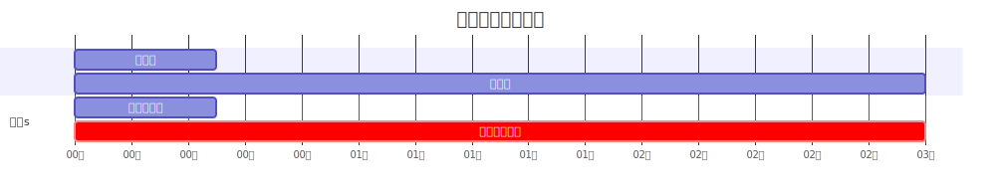

# 使用多线程

## 多线程
```rust
use std::thread;
use std::time::Duration;

fn main() {
  thread::spawn(|| {
    for i in 1..10 {
      println!("子线程： {}", i);
      //  thread::sleep 会让当前线程休眠指定的时间，随后其它线程会被调度运行
      thread::sleep(Duration::from_millis(1000));
    }
  });

  for i in 1..5 {
    println!("main {}", i);
    thread::sleep(Duration::from_millis(100));
  }
}
```
经观察：
- 只要主线程执行完成，不会关心子线程是否已经完成。
- 当主线程退出时，整个程序会立即终止，导致子线程被强制中断。

## 主线程等待子线程执行完成
```rust
use std::thread;
use std::time::Duration;

fn main() {
  let handle = thread::spawn(|| {
    for i in 1..10 {
      println!("等待的子线程： {}", i);
      thread::sleep(Duration::from_millis(1000));
    }
  });

  // 阻塞主线程直到子线程结束
  handle.join().unwrap();

  for i in 1..5 {
    println!("等待的主线程 {}", i);
    thread::sleep(Duration::from_millis(100));
  }
}
```

## 在线程闭包中数据管理

主线程变量生命周期与线程执行时序的不确定性。
```rust
use std::thread;

fn main() {
  let s = String::from("hello");

 thread::spawn(|| {
    println!("{s}");
    //         ^^^ 这里使用了外部变量s，形成闭包
    // rust无法确认新线程与主线程的执行顺序（生命周期）
  }).join().unwrap();
}
```

### 使用`move`关键字
使用`move`关键字将变量所有权移交给子线程
```rust
use std::thread;

fn main() {
  let s = String::from("hello");

 thread::spawn(move || {
    println!("{s}");
  }).join().unwrap();
}
```



### 使用`Arc<T>`在线程间共享
```rust
use std::thread;
use std::sync::Arc;

fn main() {
  let arc = Arc::new(String::from("world"));
  let arc_clone = Arc::clone(&arc);
  thread::spawn(move || {
    println!("Arc {}", arc_clone);
  }).join().unwrap();
}
```