# unsafe

## 使用裸指针

### 基于引用创建裸指针
```rust
fn main() {
    let mut num = 1u8;

    // 创建裸指针是安全行为
    let num_ptr = &num as *const u8; // 不可变指针
    let mut_num_ptr = &mut num as *mut u8; // 可变指针
    let mut_num_ptr2 = mut_num_ptr as *mut u8;

    println!("*const {:p}", num_ptr);
    println!("*mut {:p}", mut_num_ptr);

    // println!("{}", *num_ptr); // 对裸指针做解引用操作是不安全的
    //                ^^^^^^^^ 需要在unsafe块中进行
    unsafe {
        println!("{}", *num_ptr);
        *mut_num_ptr += 1;
        *mut_num_ptr2 += 1;
        println!("{}", *num_ptr);
        // 可以绕开借用检查器 可以同时拥有同一数据的多个可变、不可变借用
    }
}

```

### 通过裸指针读取内存中的值
```rust
use std::slice::from_raw_parts;
use std::str::from_utf8_unchecked;

fn main() {
    fn analyze(word: &str) -> (*const u8, usize) {
        let ptr = word.as_ptr();
        let len = word.len();
        (ptr, len)
    }

    fn peeking<'a>(ptr: *const u8, len: usize) -> &'a str {
        unsafe {
            let slice = from_raw_parts(ptr, len); // 从裸指针创建切片
            println!("slice => {:?}", slice);
            // 从切片创建字符串
            from_utf8_unchecked(slice)
        }
    }

    let word = String::from("hello");
    let (prt, len) = analyze(&word);
    println!("prt={:p}, len={}", prt, len);
    // drop(word); // 若word被提前drop, 原始裸指针指向的内存可能被其他数据覆盖
    // let text = String::from("world");
    // println!("text => {:p}", text.as_ptr());
    let word = peeking(prt, len);
    println!("word => {}", word); // 如果放开前面注释的三行代码，会发现这里的输出结果是意料之外的
}
```

### 为`Box<T>`创建裸指针
```rust
fn main() {
    let counter = Box::new(1u8);

    let counter_ptr = &*counter as *const u8; // 不会拿走所有权
    println!("counter_ptr => {:p}", counter_ptr);

    let ptr = Box::into_raw(counter); // 会夺走counter所有权
    println!("box ptr => {:p}", ptr);
}
```

| 特性                | `&*counter` 方式               | `Box::into_raw` 方式          |
|---------------------|--------------------------------|-------------------------------|
| 所有权              | 保留 `counter` 的所有权        | 转移所有权到裸指针            |
| 生命周期            | 受原 `Box` 生命周期约束         | 完全独立                      |
| 内存安全            | 安全（编译器检查）              | 不安全（需手动管理）          |
| 典型用途            | 临时访问堆数据                  | FFI 交互/手动内存管理         |
| 是否需要 `unsafe`   | 否                             | 后续操作需要                  |


## 定义`unsafe fn`
```rust
fn main() {
    unsafe fn read_ptr<T: Copy>(ptr: *const T) -> T {
    // ^^^^^^ 使用unsafe fn来定义 因为 调用者必须保证：ptr 指向有效的、已初始化的内存
    // 无法确定ptr指向的内存是否有效
        unsafe {
            *ptr
        }
        // 在rust2024中，unsafe fn中的unsafe操作也需要放在unsafe块中
    }

    let num = 1u8;
    // read_ptr(&num as *const u8);
    // ^^^^^^^^ unsafe函数的调用必须放在unsafe块中
    let value = unsafe {
        // 调用者必须保证：ptr 指向有效的、已初始化的内存
        read_ptr(&num as *const u8)
    };
    println!("value => {}", value);
}
```
### 什么时候使用`unsafe fn`?
什么时候用普通函数+`unsafe`? 



- 能自己保证安全 使用 普通 `fn`
- 需要别人保证 使用 `unsafe fn`
- 优先使用普通 `fn`：尽可能封装 `unsafe` 操作，对外提供安全接口
- 只在必要时用 `unsafe fn`：当确实需要调用者保证某些条件时
- 写清楚文档：对于 `unsafe fn`，必须说明调用者需要保证什么
- 最小化 `unsafe` 范围：即使在 `unsafe fn` 中，也用 `unsafe` 块包裹具体操作


### 将`unsafe`封装在函数内
例如：在标准库中，`Vec`有一个方法`split_at_mut`，可以将一个`vec`分割为两个可变借用。
```rust
fn main() {
    let mut vector = vec![1, 2, 3, 4, 5, 6, 7, 8, 9];
    let (before, after) = vector.split_at_mut(4);
    println!("before => {:?}, after => {:?}", before, after);
    before.iter_mut().for_each(|x| *x += 1); // 可变借用
    after.fill(0);
    println!("before => {:?}, after => {:?}", before, after);
    println!("vector => {:?}", vector); // 原始数据被修改了
}
```

我们来实现一个`split_at_mut`。
若使用可变借用，则会对`vector`同时进行两次可变借用，这在rust中是不被允许的，但是从现实的角度来说，切片的两部分互相不受影响，因此是安全，所以我们可以使用指针与`unsafe`来规避借用检查器。

```rust

fn impl_slice_vec_mut() {
    fn split_at_mut<T>(vector: &mut [T], mid: usize) -> (&mut [T], &mut [T]) {
        let len = vector.len();
        let ptr = vector.as_mut_ptr();
        // 添加边界检查
        assert!(mid <= len, "split_at_mut: mid ({}) > len ({})", mid, len);

        unsafe {
            (
                std::slice::from_raw_parts_mut(ptr, mid),
                std::slice::from_raw_parts_mut(ptr.add(mid), len - mid)
            )
        }
    }

    let mut vector = vec![1, 2, 3, 4, 5, 6, 7, 8, 9];
    let (before, after) = split_at_mut(&mut vector[..], 4);
    println!("> before => {:?}, after => {:?}", before, after);
    before.iter_mut().for_each(|x| *x += 1); // 可变借用
    after.fill(0);
    println!("> before => {:?}, after => {:?}", before, after);
    println!("> vector => {:?}", vector); // 原始数据被修改了
}
```
`from_raw_parts_mut`: 从裸指针和长度创建可变切片

安全要求（调用者必须保证）：
1. `ptr` 必须指向有效的、已初始化的内存
2. `ptr` 必须正确对齐
3. 内存范围 `[ptr, ptr + len)` 必须属于同一个已分配的对象
4. 在生成的切片生命周期内，不能有其他指针访问这块内存（独占访问）
5. 总大小 `len * size_of::<T>()` 不能超过 `isize::MAX`

为什么这里是安全的：
- `ptr` 来自有效的切片 `vector，指向已分配且初始化的内存`
- `mid` 已通过 `assert` 检查，确保 `mid <= len`
- 两个切片互不重叠：`[0, mid)` 和 `[mid, len)`
- 通过借用检查器保证了在返回的两个切片生命周期内，原始 `vector` 不会被访问。
